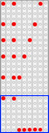
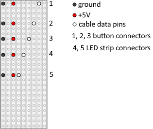
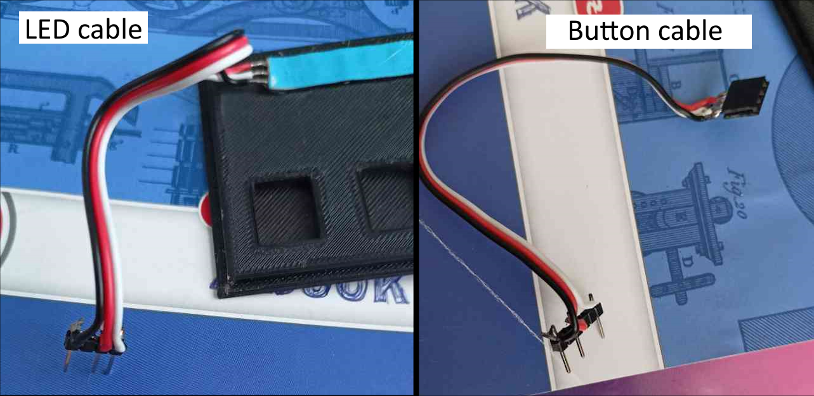
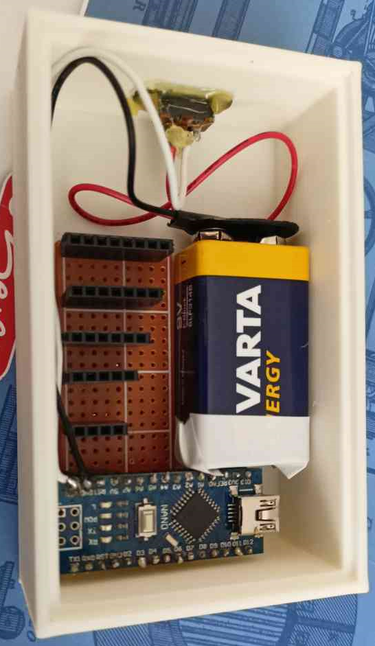
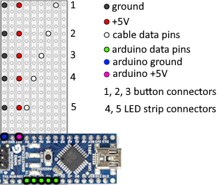
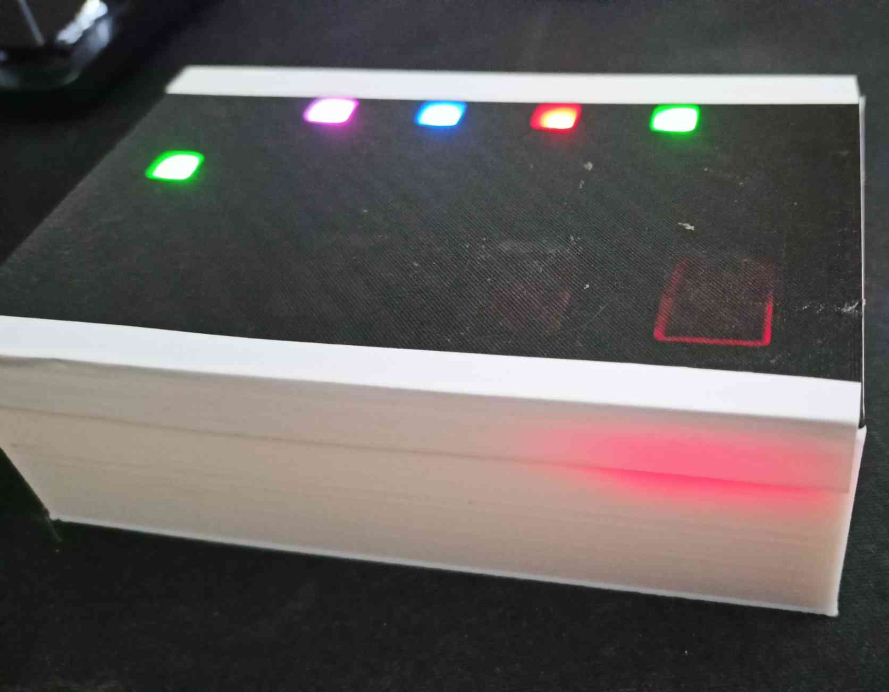
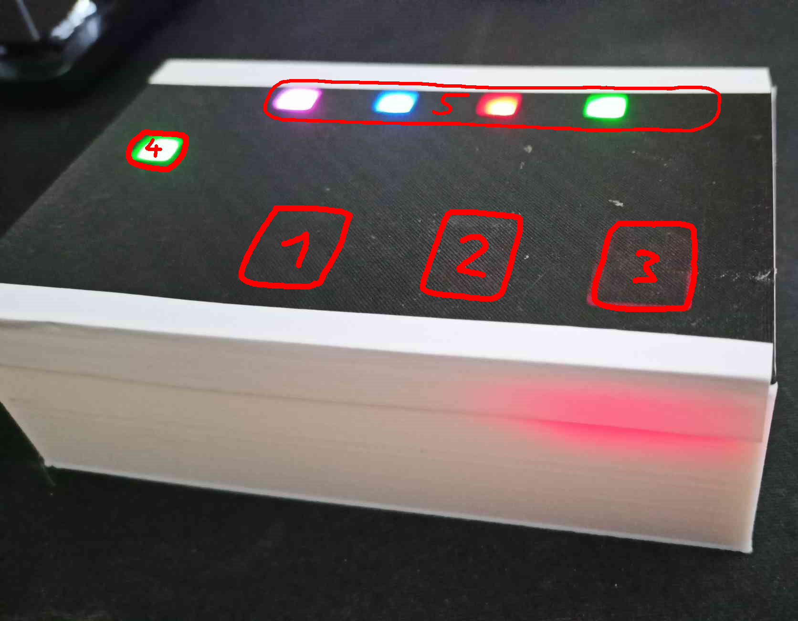

# Rozřazovací "ukazovátko"

 

Pro tvorbu náhodných týmů, rozřazení lidí do týmů, rozřazování do pracovních skupin nebo vzdělávacích aktivit.

# Co je potřeba?
- [strip board](https://www.ebay.co.uk/p/709484644) 25x9 děr (18 CZK)
- Arduino Nano (129 CZK)
- 9V baterie (~40 CZK)
- Klip na 9V baterii (3 CZK)
- [mini posuvný přepínač](https://www.allelectronics.com/item/ssw-86/spdt-mini-slide-switch/1.html) (10.0 x 5.5mm tělo) (22 CZK)
- 2 LED pásky (5 LED + 1 LED) [WS2812B](https://www.aliexpress.com/item/1005002630710155.html) (140 CZK / 1m)
- 3 TTP223 [dotyková tlačítka](https://www.aliexpress.com/item/1005004970116737.html) (15 CZK / 10ks)
- 3pinový kabel + [header konektory](https://www.aliexpress.com/item/32724478308.html) (~54 samičích + ~33 samčích) (70 CZK / 20ks)
- Finální cena ~434 CZK

# Výroba

## Krok 0:

Vytiskněte [krabičku](./stl/box.STL) a [víko](./stl/viko.stl) na 3D tiskárně

## Krok 1: Připájení samičích (female) konektorů na strip board

Podle obrázku níže připájejte samičí konektory na strip board. Piny označené barevnou tečkou připájejte ke strip boardu, zatímco ostatní piny vyjměte z konektoru.\
Mezeru mezi konektory v modrém obdélníku zanechte přesně 5 děr, protože zde bude zasazeno Arduino Nano.

## Krok 2: Vytvoření samčích (male) konektorů pro kabely

Připájejte celkem pět samčích konektorů na kabely, z toho tři kabely pro tlačítka a dva kabely pro LED pásy.
Každý kabel bude mít následující uspořádání pinů (založené na obrázku níže):

- Ground pin bude úplně vlevo.
- Dva piny vpravo od ground pinu bude +5V pin.
- Data pin pro každý kabel bude na jiném místě.

Pro tři kabely pro tlačítka vyberte tři nejdelší konektory (označené jako 1, 2 a 3 v obrázku výše).\
Pro dva kabely pro LED pásy vyberte dva nejkratší konektory (označené jako 4 a 5).\
jeden LED pás bude mít 5 LEDek (označen číslem 5), druhý LED pás bude mít pouze 1 LEDku (označen číslem 4).

## Krok 2.5: Připájení samičích konektorů na tlačítkové kabely a připojení LED pásků

Připájejte samičí konektory na druhou stranu tlačítkových kabelů podle pinů na tlačítkách.

Pokud jde o kabely pro LED pásky, nepoužívejte samičí konektory, ale připájejte kabely přímo k LED pásku.

Teď byste měli mít:
- 2 kabely s LED pásy (jeden LED pás s 5 LEDkami, druhý LED pás s 1 LEDkou)
- 3 kabely pro tlačítka

## Krok 3: Zasazení do boxu

Připájejte zem z klipu pro 9V baterii na zem Arduina a "+" 9V baterie přípájejte na posuvný přepínač a následně z přepínače na Uin Arduina.

Nahrajte připravený [kód](./main/main.ino) pomocí Arduino IDE do Arduina a nastavte piny dle potřeby (podle data pinů na obrázku níže).

Následně vložte strip board do boxu, zasuňte Arduino do připravených konektorů a vedle položte baterii. Přepínač přilepte do připravené díry na boku krabičky. (viz foto níže)

Otestujte, zda se Arduino zapne po přepnutí přepínače.

## Krok 4: Vlepení tlačítek a LED pásků do víka

Připravte si tlačítka se samčími konektory a zapojte je do připravených kabelů.

Vlepte všechna tlačítka a oba LED pásky do připravených děr ve víku. (viz foto níže)

## Krok 5: Zapojení všech kabelů

Zapojte všechny kabely do samičích konektorů a krabičku opatrně zavřete.

Otestujte, zda všechna tlačítka fungují a všechny LEDky zobrazují výstup.

# Návod k použití

Krabička má toto základní rozložení (piny můžou být upraveny podle potřeby v [kódu](./main/main.ino))

- 1 - Tlačítko pro změnu počtu skupin
    - Po stisknutí se ukáže počet vybraných skupin na horní řadě LED (na obrázku zobrazeno číslem 5)
    - Výběr počtu skupin se točí od jedné skupiny do maximálního počtu skupin, a následně znovu od jedné skupiny
- 2 - Tlačítko pro změnu módu
    - Každým stisknutím tlačítka se změní aktuálně vybraný mód
    - Vybraný mód se točí mezi 3 módy (viz bod 4)
- 3 - Tlačítko pro krokování
    - Hlavní tlačítko, kterým se podle zvoleného módu spustí jedno "vylosování"
- 4 - LED zobrazující aktuálně vybraný mód
    - Ukazovátko má 3 módy
        - ## Zelená - Ano/Ne
            - Rozsvicuje LED pás zeleně (ANO) nebo červeně (NE)
            - Šance na ANO je 50% a při každém NE se šance na ANO zvýší o 10%
            - Pokud se zobrazí ANO, šance je nastavena zpět na 50%
        - ## Červená - Posuvné cyklení skupin
            - Postupně se ukazují skupiny cyklením LED do strany
            - LEDky na výstupu mají každá jinou barvu, každá barva reprezentuje jinou skupinu
            - 
        - ## Modrá - Náhodné cyklení skupin
            - Funguje stejně jako červený mód, ale cyklení LED není do strany, ale vybírá se vždy náhodná skupina tak, aby finální počet lidí ve skupině byl rovnoměrný
            - 
- 5 - LEDky zobrazující výstup
    - Po každém stisknutí krokovacího tlačítka se zde zobrazí výstup podle zvoleného módu a počtu skupin
    - Po každém stisknutí tlačítka pro změnu počtu skupin se zde zobrazí aktuálně vybraný počet skupin