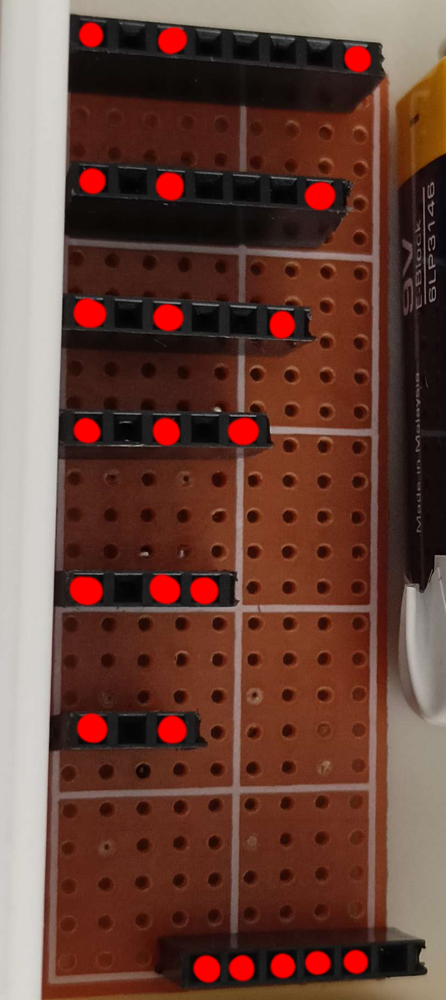
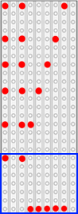
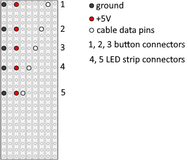
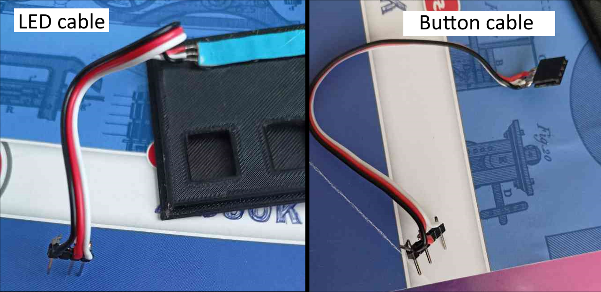
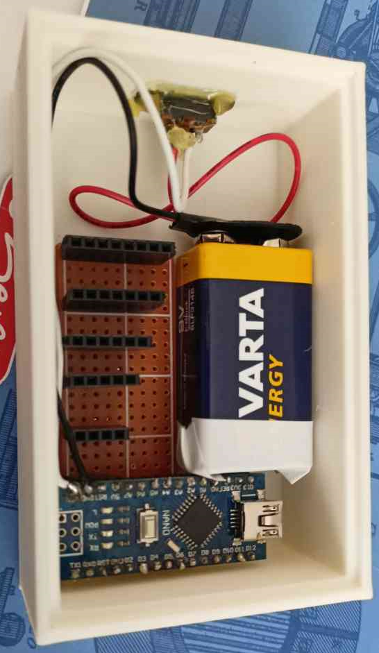
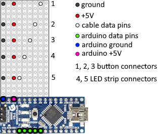
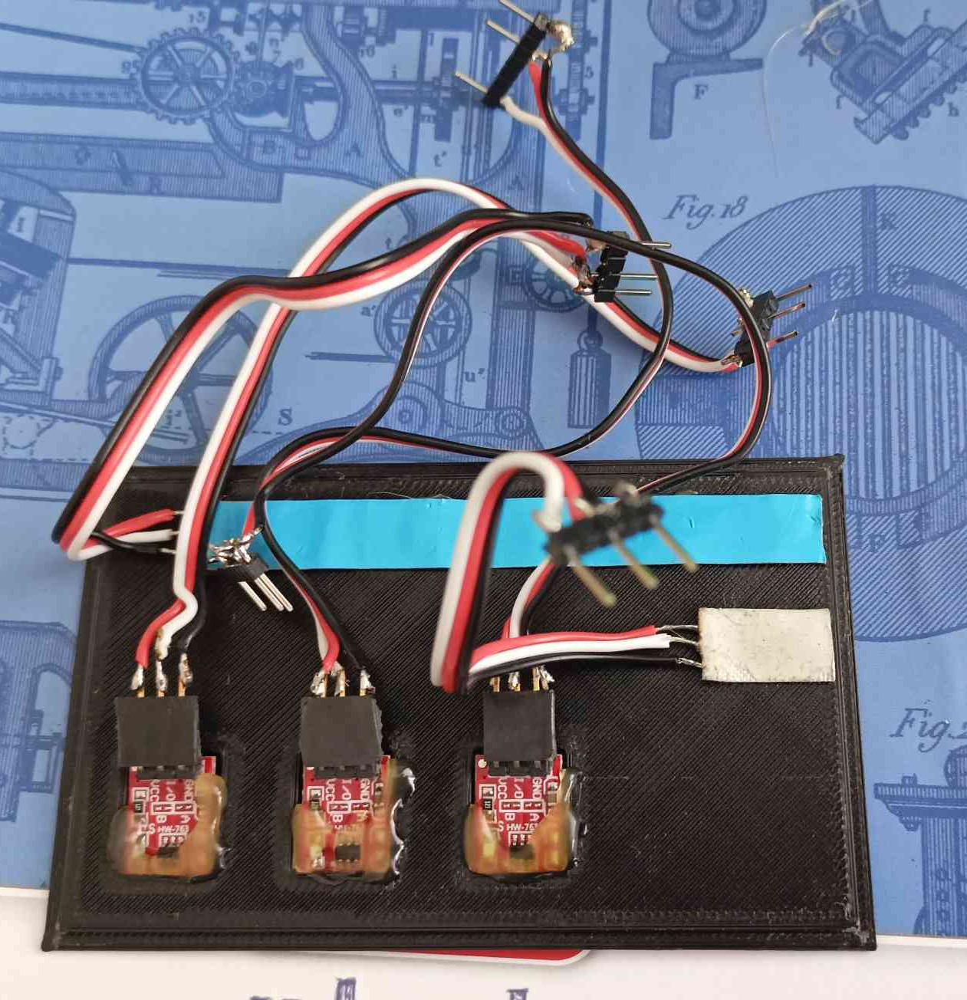
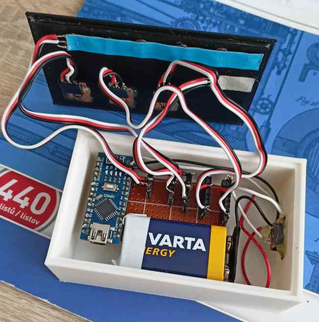
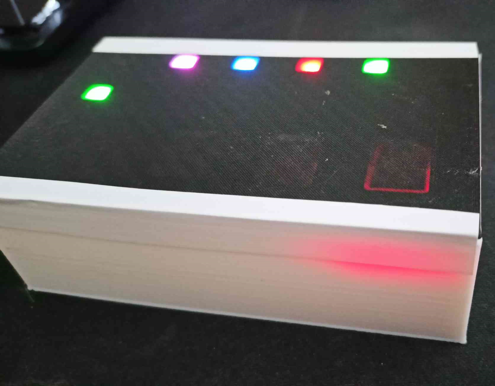
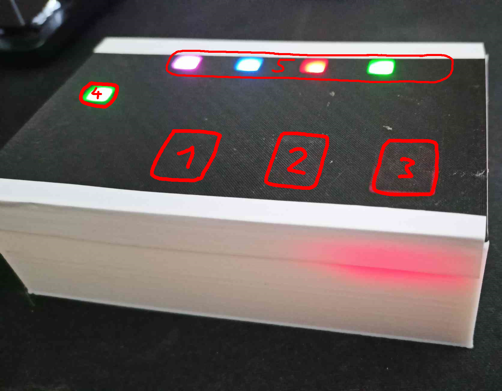

# Sorting "pointer"

 

For creating random teams, assigning people to teams, assigning people to work grous or training activities.

# What is needed?
- [strip board](https://www.ebay.co.uk/p/709484644) 25x9 holes (18 CZK)
- Arduino Nano (129 CZK)
- 9V battery (~40 CZK)
- 9V baterry clip (3 CZK)
- [mini slide switch](https://www.allelectronics.com/item/ssw-86/spdt-mini-slide-switch/1.html) (10.0 x 5.5mm body) (22 CZK)
- 2 LED strips (5 LED + 1 LED) [WS2812B](https://www.aliexpress.com/item/1005002630710155.html) (140 CZK / 1m)
- 3 TTP223 [touch buttons](https://www.aliexpress.com/item/1005004970116737.html) (15 CZK / 10ks)
- 3pin cable + [header connectors](https://www.aliexpress.com/item/32724478308.html) (~54 female + ~33 male) (70 CZK / 20ks)
- Final price ~434 CZK (~19,75 USD 5.6.2023)

# How to create one

## Step 0:

Print [box](./stl/box.STL) and [lid](./stl/viko.stl) on a 3D printer

## Step 1: Solder the female connectors to the strip board

As shown in the picture below, solder the female connectors to the strip board. Solder the pins marked with a colored dot to the strip board, and remove the other pins from the connector.\
Leave exactly 5 holes between the connectors in the blue rectangle, as this is where the Arduino Nano will be inserted.

## Step 2: Create male connectors for the cables

Solder a total of five male connectors to the cables, three of which are for the buttons and two for the LED strips.
Each cable will have the following pinout (based on the picture below):

- Ground pin will be on the far left.
- The two pins to the right of the ground pin will be the +5V pin.
- The data pin for each cable will be in a different location.

For the three button cables, select the three longest connectors (labeled 1, 2 and 3 in the image above).\
For the two cables for the LED strips, select the two shortest connectors (marked 4 and 5).\
one LED strip will have 5 LEDs (marked with the number 5), the other LED strip will have only 1 LED (marked with the number 4).

## Step 2.5: Soldering the female connectors to the button cables and soldering the LED strips

Solder the female connectors to the other side of the button cables according to the pins on the buttons.

For LED strip cables, do not use female connectors, but solder the cables directly to the LED strip.

Now you should have:
- 2 LED strip cables (one LED strip with 5 LEDs, the other LED strip with 1 LED)
- 3 cables for the buttons

## Step 3: Inserting into the box

Solder the ground from the 9V battery clip to the Arduino ground and connect the "+" of the 9V battery to the slide switch and then from the switch to the Uin of the Arduino.

Upload the provided [code](./main/main.ino) using the Arduino IDE to the Arduino and set the pins as required (according to the data pins in the image below).

Next, insert the strip board into the box, plug the Arduino into the prepared connectors and place the battery next to it. Glue the switch into the prepared hole on the side of the box. (see image below)

Test if the Arduino turns on after you flip the switch.

## Step 4: Glue the buttons and LED strips into the lid

Prepare the buttons with male connectors and plug them into the prepared cables.

Glue all buttons and both LED strips into the prepared holes in the lid (see image below).

## Step 5: Connect all cables

Plug all cables into the female connectors and close the box carefully.

Test that all buttons are working and all LEDs are showing output.

# Usage Instructions

The box has this basic layout (pins can be modified as needed in [code](./main/main.ino))

- 1 - Button to change the number of groups
    - When pressed, the number of selected groups will be shown on the top row of the LEDs (shown as a number 5 in the image)
    - The selection of the number of groups cycles from one group to the maximum number of groups, and then again from one group
- 2 - Button to change mode
    - Each press of the button changes the currently selected mode
    - The selected mode cycles between 3 modes (see point 4)
- 3 - Button for stepping
    - The main button that triggers one "draw" according to the selected mode
- 4 - LED showing the currently selected mode
    - The pointer has 3 modes
        - ## Green - Yes/No
            - Lights the LED strip green (YES) or red (NO)
            - Chance of YES is 50% and for each NO the chance of YES increases by 10%
            - If YES is displayed, the chance is set back to 50%
        - ## Red - Shift cycling group
            - Groups are progressively displayed by cycling the LED to the side
            - The LEDs on the output are each a different color, each color represents a different group
            - 
        - ## Blue - Random group cycling
            - Works the same as the red mode, but the LED cycling is not to the side, but a random group is always selected. The final number of people in a group is even
            - 
- 5 - LEDs showing an output
    - Each time the step button is pressed, the output here is displayed according to the selected mode and number of groups
    - Each time the button to change the number of groups is pressed, the currently selected number of groups is displayed here